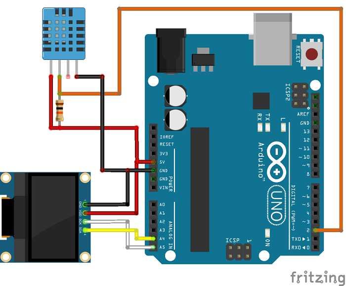

# Arduino-CyberDeck-Telemetry-Node

[](https://www.arduino.cc/)
[](#)
[](#)
[](https://github.com/iPranjalDas)

📟 Standalone modular cyberdeck terminal with OLED multi-bus display, sensor telemetry, & low-power sleep.

---

## 🖥️ System Architecture & Visual Wiring Layout

### 🔌 Graphical Schematic & Pinout Diagrams




```
┌── CYBERDECK MODULAR HARDWARE ARCHITECTURE ──────────────────────────────┐
│                                                                         │
│   [SSD1306 128x64 I2C OLED]               [Multi-Sensor Bus]            │
│   SDA ──> Pin A4                          • DHT22 Temperature/Humidity  │
│   SCL ──> Pin A5                          • BMP280 Barometric Pressure  │
│                                           • Battery Voltage Divider     │
│   [Tactile Matrix Input]                                                │
│   • Nav Up/Down/Select Keys               [Telemetry Shell]             │
│   • Hardware Interrupt Trigger            • Real-time system clock      │
│   • Deep sleep wake pin                   • Diagnostic bus inspector    │
└─────────────────────────────────────────────────────────────────────────┘
```

---

## 🛠️ Hardware Requirements & Components

- **Microcontroller / Core:** Arduino Uno / ESP32 / NodeMCU (Refer to `.ino` sketch)
- **Power Supply:** 5V / 12V external regulated battery pack
- **Sensors & Actuators:** Detailed in circuit diagram and sketch pinout headers

---

## 🚀 Installation & Upload

1. Clone this repository:
   ```bash
   git clone https://github.com/iPranjalDas/Arduino-CyberDeck-Telemetry-Node.git
   ```
2. Open the primary `.ino` sketch in the [Arduino IDE](https://www.arduino.cc/en/software).
3. Install required libraries via the Arduino Library Manager.
4. If this sketch uses Wi-Fi, update `YOUR_WIFI_SSID` and `YOUR_WIFI_PASSWORD` with your local network settings.
5. Select your target board and COM port, then click **Upload**.

---

## 🔒 Security & Privacy Notice
All source sketches have been thoroughly sanitized. Generic placeholder strings are used for network credentials and API tokens.

---

## 📄 License
This project is licensed under the MIT License - see the [LICENSE](LICENSE) file for details.  
Copyright (c) 2026 Pranjal Das. All Rights Reserved.

---

## 👤 Author & Architecture
**Pranjal Das**  
- **GitHub:** [@iPranjalDas](https://github.com/iPranjalDas)
- **Projects:** [https://iPranjalDas.github.io/Projects/](https://iPranjalDas.github.io/Projects/)
